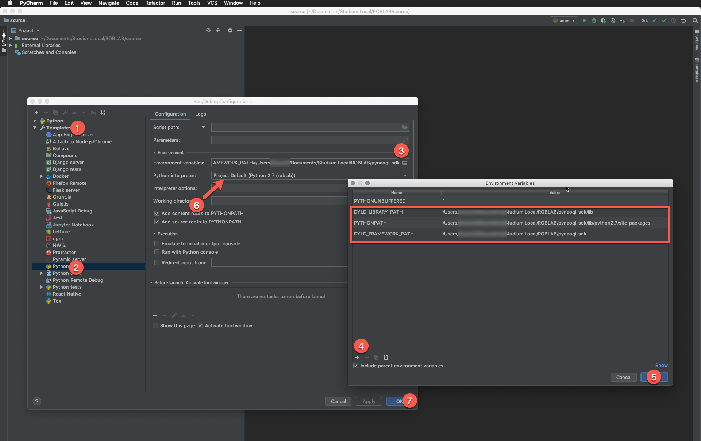

# python Naoqi Installation Guide for macOS (with conda)

## tested on this macOS
- *Notebook:* MacBook Pro (15-inch, 2016)
- *OS:* macOS High Sierra 10.13
- *LoginUser:* userxy

### function wroblab:
```shell
function wroblab {
  if [ -d /Users/userxy/Documents/Studium.Local/ROBLAB/source ]; then
    cd /Users/userxy/Documents/Studium.Local/ROBLAB/source
    source activate roblab
    export PYTHONPATH=~/Documents/Studium.Local/ROBLAB/pynaoqi-sdk/lib/python2.7/site-packages
    export DYLD_LIBRARY_PATH=~/Documents/Studium.Local/ROBLAB/pynaoqi-sdk/lib
    export DYLD_FRAMEWORK_PATH=~/Documents/Studium.Local/ROBLAB/pynaoqi-sdk
  fi
}
```

## Prerequisites:
- pynaoqi-sdk: pynaoqi-python2.7-2.5.5.5-mac64.tar.gz (date: 2. Oct 2018)
- python: Python 2.7 from Python.org (it must be the version from Python.org - any other python version, as example from conda or native macOS-python, will NOT work)

## Installation guide
1. Install Python 2.7 from Python.org
2. Check if `/usr/local/bin/python` is correct installed (do not use `/usr/bin/python`)
3. Download and extract the latest python-sdk for naoqi
   * (optional) create a new conda env
   * (optional) move to the `python` link to `/usr/local/bin/python` (example: `ln -s /usr/local/bin/python python2.7`)
4. Check if `PYTHONPATH`, `DYLD_LIBRARY_PATH` and `DYLD_FRAMEWORK_PATH` are set correct
   * (optional) When you use conde, you can set the conda environment variables direct in conda
   * (optional) more infos below.
5. Test it `python -c 'import naoqi'`


## conda environment variables for naoqi
1. Activate your conda environment `source activate pepper-env`
2. Check if the `$CONDA_PREFIX` is set correctly: `echo $CONDA_PREFIX`
3. Enter that directory and create these subdirectories and files:
```shell
cd $CONDA_PREFIX
mkdir -p ./etc/conda/activate.d
mkdir -p ./etc/conda/deactivate.d
touch ./etc/conda/activate.d/env_vars.sh
touch ./etc/conda/deactivate.d/env_vars.sh
```

4. Edit ./etc/conda/activate.d/env_vars.sh
```shell
#!/bin/sh

export PYTHONPATH=/Users/userxy/Documents/Studium.Local/ROBLAB/pynaoqi-sdk/lib/python2.7/site-packages
export DYLD_LIBRARY_PATH=/Users/userxy/Documents/Studium.Local/ROBLAB/pynaoqi-sdk/lib
export DYLD_FRAMEWORK_PATH=/Users/userxy/Documents/Studium.Local/ROBLAB/pynaoqi-sdk
```

5. Edit ./etc/conda/deactivate.d/env_vars.sh
```shell
#!/bin/sh

unset PYTHONPATH
unset DYLD_LIBRARY_PATH
unset DYLD_FRAMEWORK_PATH
```

6. Test our conda 
```shell
source activate pepper-env
echo $PYTHONPATH
echo $DYLD_LIBRARY_PATH
echo $DYLD_FRAMEWORK_PATH
```

## environment proof
```shell
macBookPro:~ userxy$ date
Tue Oct  2 22:13:01 CEST 2018
macBookPro:~ userxy$ wroblab
(roblab) macBookPro:source userxy$ echo ${PYTHONPATH}
/Users/userxy/Documents/Studium.Local/ROBLAB/pynaoqi-sdk/lib/python2.7/site-packages
(roblab) macBookPro:source userxy$ echo ${DYLD_LIBRARY_PATH}
/Users/userxy/Documents/Studium.Local/ROBLAB/pynaoqi-sdk/lib
(roblab) macBookPro:source userxy$ echo $DYLD_FRAMEWORK_PATH
/Users/userxy/Documents/Studium.Local/ROBLAB/pynaoqi-sdk
(roblab) macBookPro:source userxy$ which python
/Users/userxy/Applications/anaconda3/envs/roblab/bin/python
(roblab) macBookPro:source userxy$ ls -l /Users/userxy/Applications/anaconda3/envs/roblab/bin/python
lrwxr-xr-x  1 userxy  staff  9 Sep 27 13:51 /Users/userxy/Applications/anaconda3/envs/roblab/bin/python -> python2.7
(roblab) macBookPro:source userxy$ ls -l /Users/userxy/Applications/anaconda3/envs/roblab/bin/python2.7
lrwxr-xr-x  1 userxy  staff  21 Oct  2 22:12 /Users/userxy/Applications/anaconda3/envs/roblab/bin/python2.7 -> /usr/local/bin/python
(roblab) macBookPro:source userxy$ ls -l /usr/local/bin/python
lrwxr-xr-x  1 root  wheel  68 Oct  2 17:01 /usr/local/bin/python -> ../../../Library/Frameworks/Python.framework/Versions/2.7/bin/python
(roblab) macBookPro:source userxy$ ls -l /Library/Frameworks/Python.framework/Versions/2.7/bin/python
lrwxr-xr-x  1 root  admin  7 Oct  2 17:01 /Library/Frameworks/Python.framework/Versions/2.7/bin/python -> python2
(roblab) macBookPro:source userxy$ ls -l /Library/Frameworks/Python.framework/Versions/2.7/bin/python2
lrwxr-xr-x  1 root  admin  9 Oct  2 17:01 /Library/Frameworks/Python.framework/Versions/2.7/bin/python2 -> python2.7
(roblab) macBookPro:source userxy$ ls -l /Library/Frameworks/Python.framework/Versions/2.7/bin/python2.7
-rwxrwxr-x  1 root  admin  25624 Apr 30 02:51 /Library/Frameworks/Python.framework/Versions/2.7/bin/python2.7
(roblab) macBookPro:source userxy$ python
Python 2.7.15 (v2.7.15:ca079a3ea3, Apr 29 2018, 17:49:27)
[GCC 4.2.1 (Apple Inc. build 5666) (dot 3)] on darwin
Type "help", "copyright", "credits" or "license" for more information.
>>> import struct;print( 8 * struct.calcsize("P"))
64
>>> import naoqi
>>> import qi
>>> exit()
```


# python Naoqi with PyCharm (macOS)

## Configuration PyCharm

### Project Interpreter
change the project interpreter to conda-env


### Run / Configuration


### Add Naoqi Variables to the default project Configuration

